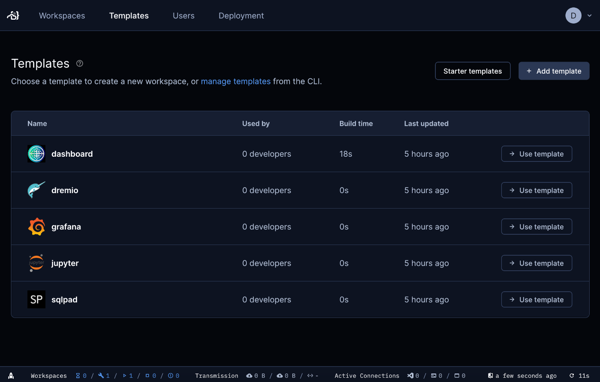

# Deploying components

While core tools of the platform are already up and running after installation, other components have to be individually deployed. This is easily and quickly done by creating workspaces in *Coder*, by using templates.

Open your browser and go to the address of the Coder instance of the Digital Hub platform which should have been provided to you. You will need to sign in and will then be directed to the *Workspaces* page.

Access the *Templates* tab at the top. Available templates are listed.

To deploy one of these tools, click its corresponding *Use template* button. It will ask for a name for the workspace, the owner, and possibly a number of configurations that change depending on the template. More details on each template's configuration will be described in its respective component's section.

Once a component has been created, it will appear under the *Workspaces* tab, but may take a few minutes before it's *Running*. Then, you can click on it to open its overview, and access the tools it offers by using the buttons above the logs.