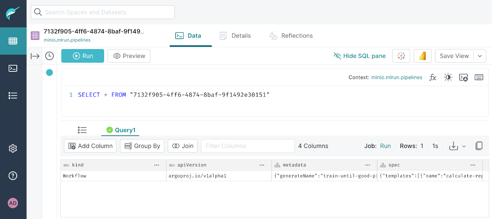

# Dremio

[Dremio](https://www.dremio.com/) provides unified access to data from heterogeneous sources, combining them and granting the ability to visualize them.

- Support for many common sources (relational DBs, *NoSQL*, *Parquet*, *JSON*, *Excel*, etc.)
- Run read-only SQL queries and join data independently of source
- Create virtual datasets from queries

!!! info "How to access"

    Dremio may be launched from [Coder, using its template](/digitalhub/components/deploying-components). It will ask for a *Dremio Admin Password*. Access Dremio by logging in with username `admin` and this password.

    The template automatically configures connections to both MinIO (*Object Storage*) and Postgres (*Database*), so you do not need to worry about adding them.

## Query data sources

Once in, you will notice MinIO and Postgres on the left, under *Sources*. There may already be some data we can use for a quick test.

Click on *minio* and you may see a file listed to the right or, if you see a folder instead, navigate deeper until you find a file. Click on any file you may have found. If the format was explicitly specified in the name, Dremio will detect it and offer a number of settings for the dataset. If not, try different values of *Format* until one seems correct. Then, click *Save*.

Dremio will switch to to the *SQL Runner* and you can run queries against the file you selected.

Of course, you may also run queries against the Postgres database.

## Resources

- [Official documentation](https://docs.dremio.com/)