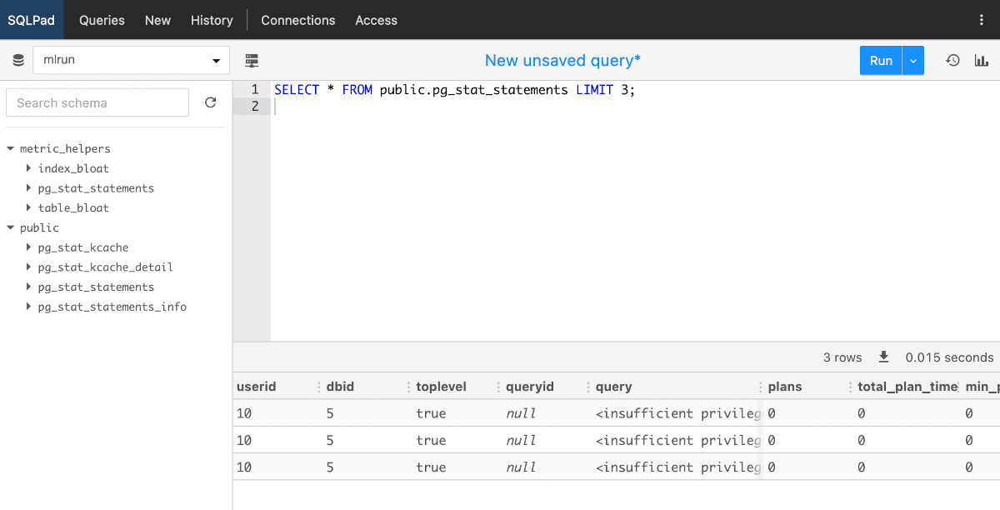

# SQLPad

[SQLPad](https://github.com/sqlpad/sqlpad) provides a simple interface for connecting to a database, write and run SQL queries.

- Support for *Postgres*, *MySQL*, *SQLite*, etc., plus the ability to support more via ODBC
- Visualize results quickly with line or bar graphs
- Save queries and graph settings for further use

!!! info "How to access"

    SQLPad may be launched from [Coder, using its template](/digitalhub/components/deploying-components).

    The template automatically configures connection to Postgres, so you do not need to worry about setting it up.

## Running a simple query

When SQLPad is opened, it will display schemas and their tables to the left, and an empty space to the right to write queries in.

Even if freshly deployed, some system tables are already present, so let's run a simple query to test the tool. Copy and paste the following:
``` sql
SELECT * FROM public.pg_stat_statements LIMIT 3;
```
This query asks for all (`*`) fields of `3` records within the `pg_stat_statements` table of the `public` schema. Note that `public` is the default schema, so you could omit the `public.` part.

Click on *Run*, and you will notice some results appearing at the bottom.



## Resources

- [Official documentation](https://getsqlpad.com/en/introduction/)