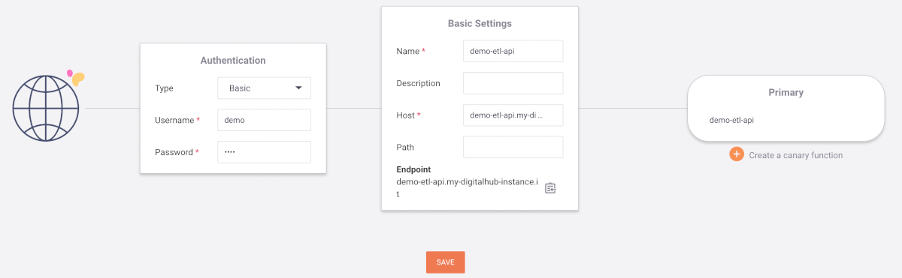

# Expose datasets as API

We define an exposing function to make the data reachable via REST API:
``` python
%%writefile 'src/api.py'

import mlrun
import pandas as pd
import os

DF_URL = os.environ["DF_URL"]
df = None


def init_context(context):
    global df
    context.logger.info("retrieve data from {}".format(DF_URL))
    di = mlrun.run.get_dataitem(DF_URL)
    df = di.as_df()


def handler(context, event):
    global df
    if df is None:
        return context.Response(
            body="", headers={}, content_type="application/json", status_code=500
        )

    # mock REST api
    method = event.method
    path = event.path
    fields = event.fields

    id = False

    # pagination
    page = 0
    pageSize = 50

    if "page" in fields:
        page = int(fields['page'])

    if "size" in fields:
        pageSize = int(fields['size'])

    if page < 0:
        page = 0

    if pageSize < 1:
        pageSize = 1

    if pageSize > 100:
        pageSize = 100

    start = page * pageSize
    end = start + pageSize
    total = len(df)

    if end > total:
        end = total

    ds = df.iloc[start:end]
    json = ds.to_json(orient="records")

    res = {"data": json, "page": page, "size": pageSize, "total": total}

    return context.Response(
        body=res, headers={}, content_type="application/json", status_code=200
    )
```

Register the function:
``` python
api_fn = project.set_function("src/api.py", name="api", kind="nuclio", image="mlrun/mlrun", handler='handler')
```

Configure the function for deployment:
``` python
DF_KEY = 'store://datasets/demo-etl/process-measures-process_dataset-measures'
api_fn.set_env(name='DF_URL', value=DF_KEY)
api_fn.with_requests(mem='64M',cpu="250m")
api_fn.spec.replicas = 1
project.save()
```

Deploy (may take a few minutes):
``` python
api_fn.deploy()
```

Invoke the API and print its results:
``` python
res = api_fn.invoke("/?page=5&size=10")
print(res)
```

You can also use *pandas* to load the result in a data frame:
``` python
rdf = pd.read_json(res['data'], orient='records')
rdf.head()
```

## Create an API gateway

Right now, the API is only accessible from within the environment. To make it accessible from outside, we'll need to create an API gateway.

Go to your Coder instance, go to the dashboard and access Nuclio. You will notice a `demo-etl` project, which we created earlier. When you access it, you will see the `demo-etl-api` function listed, but click on the *API GATEWAYS* tab on top instead. Then, click on *NEW API GATEWAY*.

On the left, if you wish, set *Authentication* to *Basic* and choose *Username* and *Password*.

In the middle, set any *Name* you want. *Host* must use the same domain as the other components of the Digital Hub. For example, if you access Coder at `coder.my-digitalhub-instance.it`, the *Host* field should use a value like `demo-etl-api.my-digitalhub-instance.it`.

On the right, under *Primary*, you must enter the name of the function, in this case `demo-etl-api`.



*Save* and, after a few moments, you will be able to call the API at the address you entered in *Host*! If you set *Authentication* to *Basic*, don't forget that you have to provide the credentials.